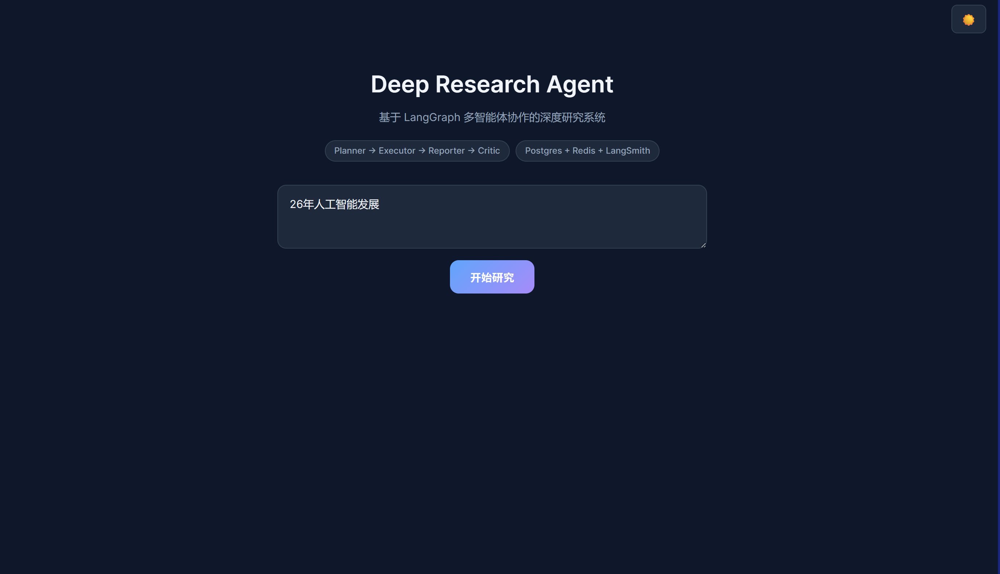
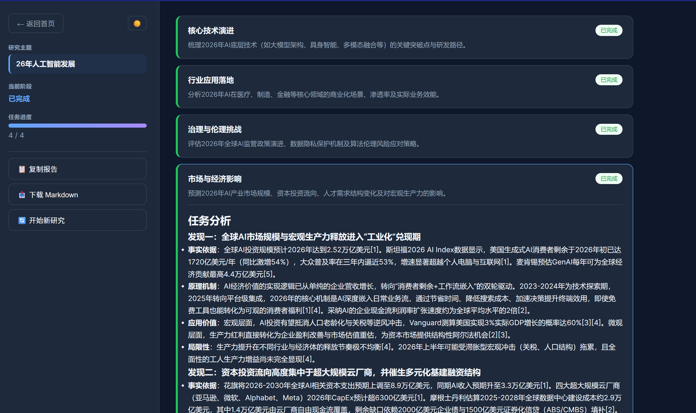
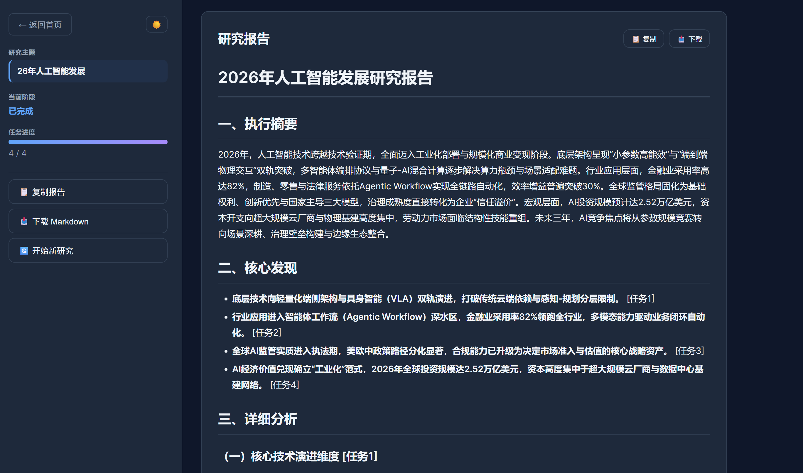
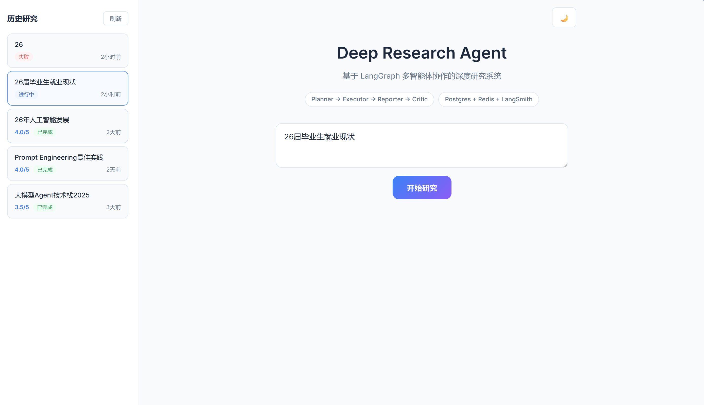

<div align="center">

# Multi-Agent Deep Research System

**A multi-agent deep research system — enter a topic, get a structured research report**

[](https://www.python.org/)
&nbsp;
[](https://github.com/langchain-ai/langgraph)
&nbsp;
[](https://fastapi.tiangolo.com/)
&nbsp;
[](https://vuejs.org/)
&nbsp;
[](./LICENSE)

[中文](README.md) | [English](README.en.md)

</div>

---

## Introduction

Enter a research topic and the system runs the full pipeline — task decomposition, multi-source search, analysis, report drafting, quality review and iterative refinement. Four specialized agents (**Planner / Executor / Reporter / Critic**) are orchestrated with LangGraph; conditional edges trigger extra retrieval and report revision whenever the quality score falls below threshold, producing a structured, traceable Markdown report.

## Demo

<div align="center">
  
  <br>
  <em>Figure 1 · Home page</em>
</div>

<br>

<div align="center">
  
  <br>
  <em>Figure 2 · Subtask progress</em>
</div>

<br>

<div align="center">
  
  <br>
  <em>Figure 3 · Generated research report</em>
</div>

<br>

<div align="center">
  
  <br>
  <em>Figure 4 · Report history</em>
</div>

## Architecture

```
                                Research topic
                                      │
                                      ▼
        ┌─────────────────────────────────────────────────────────────┐
        │                    LangGraph state machine                   │
        │                                                             │
        │  ┌──────────┐    ┌──────────┐    ┌──────────┐    ┌────────┐ │
        │  │ Planner  │───▶│ Executor │───▶│ Reporter │───▶│ Critic │ │
        │  │  task    │    │  search  │    │  report  │   │ quality│ │
        │  │  breakdown│   │  + digest │    │  writing │   │  score │ │
        │  └──────────┘    └──────────┘    └──────────┘    └───┬────┘ │
        │       ↑                                              │      │
        │       │         score < threshold → re-search       │      │
        │       └──────────────────────────────────────────────┘      │
        └─────────────────────────────────────────────────────────────┘
               │                    │                    │
               ▼                    ▼                    ▼
        ┌────────────┐    ┌──────────────┐    ┌────────────────┐
        │   Tavily   │    │ PostgreSQL 16│    │    Redis 7     │
        │  hybrid    │    │  sessions &  │    │  MD5 semantic  │
        │  search    │    │  tasks       │    │  cache         │
        └────────────┘    └──────────────┘    └────────────────┘
```

### Agent Roles

| Stage | Agent | Responsibility |
|:-----:|-------|----------------|
| **1** | **Planner** | Takes the topic, decomposes it into 3–5 complementary subtasks and generates English search keywords for each |
| **2** | **Executor** | Runs each subtask: Tavily / DuckDuckGo search → Redis cache lookup → LLM summarisation |
| **3** | **Reporter** | Merges all subtask summaries into a structured report following a six-section template (executive summary → key findings → detailed analysis → comparisons → risks & recommendations → outlook) |
| **4** | **Critic** | Scores the report on completeness, accuracy, structure, depth and actionability (1–5), emits structured JSON feedback and triggers another iteration when below threshold |

### Iterative Refinement

<div align="center">

```
Round 1: Planner → Executor → Reporter → Critic (3.5/5, below threshold)
                                                    │
                                    with feedback ↓  Round 2: Executor (extra search) → Reporter (revised report) → Critic (4.2/5, pass → END)
```

</div>

## Features

| Feature | Description |
|---------|-------------|
| **Multi-agent orchestration** | Four agents coordinated by a LangGraph StateGraph, shared state for context, conditional edges for dynamic routing |
| **LLM-as-Judge** | The critic agent scores five dimensions and returns structured JSON feedback (strengths / weaknesses / suggestions); below threshold it iterates again |
| **Hybrid search** | Tavily (advanced mode) primary, DuckDuckGo fallback — both free to use |
| **Semantic cache** | Redis caches search queries by MD5 with a 1-hour TTL to avoid repeated LLM calls |
| **State persistence** | PostgreSQL 16 records all sessions and tasks, with automatic in-memory fallback if the database or cache is unavailable |
| **SSE streaming** | FastAPI Server-Sent Events push progress live, so the UI renders without a blank screen |
| **Full tracing** | Optional LangSmith integration — add your API key to inspect call chains, latency and token usage |
| **Dark mode** | The frontend supports light/dark switching; reports can be copied or downloaded as Markdown |

## Tech Stack

| Layer | Choice |
|-------|--------|
| AI orchestration | LangGraph 1.1 (StateGraph + conditional edges) |
| LLM | Qwen / GPT / DeepSeek / any OpenAI-compatible API |
| Backend | FastAPI + uvicorn + asyncio |
| Database | PostgreSQL 16 (asyncpg connection pool) |
| Cache | Redis 7 (redis-py async client) |
| Tracing | LangSmith (optional, add your key) |
| Frontend | Vue 3 + TypeScript + marked |
| Search | Tavily Search API + DuckDuckGo |
| Deployment | Docker Compose |

## Quick Start

### Requirements

- **Python** ≥ 3.10
- **Node.js** ≥ 18
- **Docker Desktop**

### 1. Clone

```bash
git clone https://github.com/lhh737/Multi-Agent-DeepsearchSystem.git
cd Multi-Agent-DeepsearchSystem
```

### 2. Start the database and cache

```bash
docker compose up -d
```

### 3. Configure API keys

Create a `.env` file in `backend/`:

```env
# LLM (required, any OpenAI-compatible endpoint)
LLM_BASE_URL=https://dashscope.aliyuncs.com/compatible-mode/v1
LLM_API_KEY=sk-your-api-key
LLM_MODEL_ID=qwen3.6-flash

# Search (optional — falls back to free DuckDuckGo if unset)
TAVILY_API_KEY=tvly-your-tavily-key

# LangSmith tracing (optional)
LANGSMITH_API_KEY=lsv2-your-langsmith-key

# Database and cache (defaults match docker-compose.yml)
PG_HOST=localhost
PG_PASSWORD=deepresearch
REDIS_HOST=localhost
```

### 4. Install and run

```bash
# ── Terminal 1: backend ──
cd backend
python -m venv .venv
source .venv/bin/activate      # macOS / Linux
.venv\Scripts\activate         # Windows
pip install -r requirements.txt
uvicorn app.main:app --host 0.0.0.0 --port 8000

# ── Terminal 2: frontend ──
cd frontend
npm install
npx vite --port 5174
```

### 5. Open the browser

Visit **http://localhost:5174** and enter a research topic.

## Project Structure

```
Multi-Agent-DeepsearchSystem/
│
├── backend/
│   ├── app/
│   │   ├── main.py                   # FastAPI entry · SSE streaming · lifecycle
│   │   ├── config.py                 # Environment configuration
│   │   ├── agents/                   # ▸ The four agent nodes
│   │   │   ├── planner.py            #   Planner · task decomposition
│   │   │   ├── executor.py           #   Executor · search + summarisation
│   │   │   ├── reporter.py           #   Reporter · report assembly
│   │   │   └── critic.py             #   Critic · quality review
│   │   ├── graph/                    # ▸ LangGraph state machine
│   │   │   ├── state.py              #   State definition
│   │   │   └── builder.py            #   Graph construction · conditional routing · persistence
│   │   ├── tools/search.py           # Search tools (Tavily + DDG + cache)
│   │   ├── prompts/templates.py      # Prompt templates
│   │   ├── persistence/              # PostgreSQL layer
│   │   │   ├── database.py           #   Connection pool · schema init
│   │   │   └── repository.py         #   Session / task CRUD
│   │   ├── cache/redis_cache.py      # Redis cache (MD5 + TTL)
│   │   └── tracing/langsmith.py      # LangSmith integration
│   ├── requirements.txt
│   └── pyproject.toml
│
├── frontend/
│   ├── src/
│   │   ├── App.vue                   # Main component
│   │   ├── services/api.ts           # SSE streaming client
│   │   └── main.ts                   # Vue entry
│   ├── package.json
│   └── vite.config.ts
│
├── demo/                             # Screenshots
├── docker-compose.yml                # PostgreSQL 16 + Redis 7
└── README.md
```

## API Reference

### Endpoints

| Endpoint | Method | Description |
|----------|--------|-------------|
| `/healthz` | GET | Health check (returns PostgreSQL / Redis connection status) |
| `/research` | POST | Submit a topic, blocks until the report is ready |
| `/research/stream` | POST | Streams research progress over SSE |
| `/sessions` | GET | List past research sessions |
| `/sessions/{id}` | GET | Session detail (includes all subtasks) |

### SSE events

| Event | Emitted when | Payload |
|-------|--------------|---------|
| `status` | Stage changes | `message` status description |
| `todo_list` | Planning complete | `tasks` subtask list |
| `task_status` | Subtask status changes | `task_id` / `status` / `summary` / `sources` |
| `critic_result` | Review complete | `score` / `feedback` / `iteration` |
| `final_report` | Report generated | `report` Markdown text / `session_id` |
| `done` | Pipeline finished | — |

### Examples

```bash
# Non-streaming
curl -X POST http://localhost:8000/research \
  -H "Content-Type: application/json" \
  -d '{"topic":"2025 trends in AI agent technology"}'

# SSE streaming
curl -N -X POST http://localhost:8000/research/stream \
  -H "Content-Type: application/json" \
  -d '{"topic":"Production practices for LLM applications"}'
```

## License

MIT © [lhh737](https://github.com/lhh737)