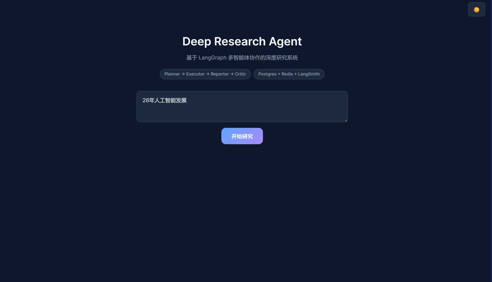
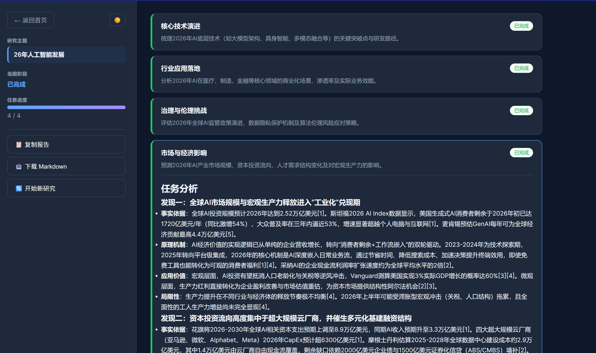
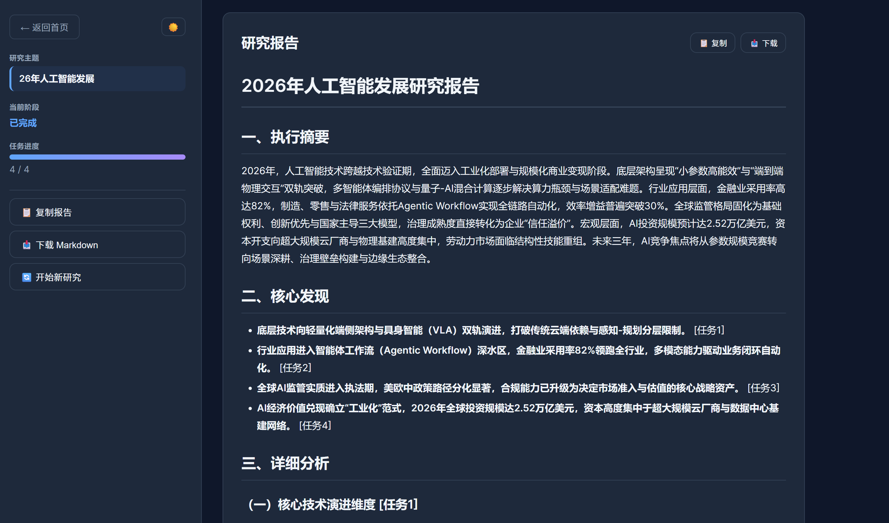
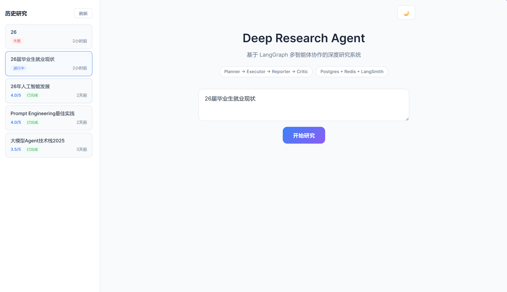

<div align="center">

# Multi-Agent Deep Research System

**基于 LangGraph 的多智能体深度研究系统 — 输入主题，自动产出结构化研究报告**

[](https://www.python.org/)
&nbsp;
[](https://github.com/langchain-ai/langgraph)
&nbsp;
[](https://fastapi.tiangolo.com/)
&nbsp;
[](https://vuejs.org/)
&nbsp;
[](./LICENSE)

</div>

---

## 项目简介

输入一个研究主题，系统自动完成「任务拆解 → 多源搜索 → 分析总结 → 报告生成 → 质量评审 → 迭代优化」全流程。围绕 LangGraph 构建了 **Planner / Executor / Reporter / Critic** 四个专用 Agent，通过条件路由实现评分不足时自动补充检索与报告优化，最终输出一份结构严谨、来源可追溯的 Markdown 研究报告。

## 效果展示

<div align="center">



*图1. 首页效果图*

&nbsp;



*图2. 子任务进程效果图*

&nbsp;



*图3. 研究报告效果图*



*图4. 报告保存图*

</div>

## 技术架构

<div align="center">

```
                                用户输入研究主题
                                      │
                                      ▼
        ┌─────────────────────────────────────────────────────────────┐
        │                    LangGraph 状态机                          │
        │                                                             │
        │  ┌──────────┐    ┌──────────┐    ┌──────────┐    ┌────────┐ │
        │  │ Planner  │───→│ Executor │───→│ Reporter │───→│ Critic │ │
        │  │ 任务拆解  │    │ 搜索+摘要 │    │ 报告生成  │   │ 质量评分│ |
        │  └──────────┘    └──────────┘    └──────────┘    └───┬────┘ │
        │       ↑                                              │      │
        │       │         评分 < 阈值 → 携带反馈重搜             │      │
        │       └──────────────────────────────────────────────┘      │
        └─────────────────────────────────────────────────────────────┘
               │                    │                    │
               ▼                    ▼                    ▼
        ┌────────────┐    ┌──────────────┐    ┌────────────────┐
        │   Tavily   │    │ PostgreSQL 16│    │    Redis 7      │
        │  混合搜索   │    │  会话·任务   │    │  MD5 语义缓存    │
        └────────────┘    └──────────────┘    └────────────────┘
```

</div>

### Agent 职责

| 阶段 | Agent | 核心职责 |
|:---:|---|---|
| **1** | **Planner** | 接收研究主题，LLM 拆解为 3~5 个互补子任务，为每个子任务生成英文检索关键词 |
| **2** | **Executor** | 逐任务执行：Tavily / DuckDuckGo 搜索 → 查 Redis 缓存 → LLM 深度分析摘要 |
| **3** | **Reporter** | 整合所有子任务摘要，按六章模板输出结构化报告（执行摘要 → 核心发现 → 详细分析 → 对比洞察 → 风险建议 → 总结展望） |
| **4** | **Critic** | 从完整性、准确性、结构、深度、可操作性五个维度评分（1~5），低于阈值时生成改进建议并触发下一轮迭代 |

### 迭代优化

<div align="center">

```
第 1 轮: Planner → Executor → Reporter → Critic (3.5/5, 不合格)
                                                    │
                                    携带反馈 ↓      第 2 轮: Executor(补充搜索) → Reporter(优化报告) → Critic (4.2/5, 通过 → END)
```

</div>

## 核心特性

| 特性 | 说明 |
|---|---|
| **Multi-Agent 协作** | 4 个 Agent 通过 LangGraph StateGraph 编排，Shared State 传递上下文，conditional edges 动态路由 |
| **LLM-as-Judge** | Critic Agent 五维评分，输出 JSON 结构化反馈（优点/缺陷/建议），低于阈值自动迭代 |
| **混合搜索** | Tavily（advanced 模式）为主，DuckDuckGo 兜底，均免费可用 |
| **语义缓存** | Redis 对搜索 query 做 MD5 → TTL 1h 缓存，避免重复 LLM 调用 |
| **状态持久化** | PostgreSQL 16 全量记录会话与任务，数据库/Redis 不可用时自动降级内存存储 |
| **SSE 实时流式** | FastAPI Server-Sent Events 实时推送进度，前端即时渲染无白屏 |
| **全链路追踪** | LangSmith 集成（可选），填入 API Key 即可在控制台查看调用链、耗时、Token 消耗 |
| **暗色模式** | 前端支持亮/暗切换，报告支持一键复制与 Markdown 下载 |

## 技术栈

| 层级 | 技术选型 |
|---|---|
| AI 编排 | LangGraph 1.1（StateGraph + Conditional Edges） |
| 语言模型 | Qwen / GPT / DeepSeek / 任意 OpenAI 兼容 API |
| 后端 | FastAPI + uvicorn + asyncio |
| 数据库 | PostgreSQL 16（asyncpg 连接池） |
| 缓存 | Redis 7（redis-py 异步客户端） |
| 追踪 | LangSmith（可选，填入 Key 即启用） |
| 前端 | Vue 3 + TypeScript + marked |
| 搜索 | Tavily Search API + DuckDuckGo |
| 部署 | Docker Compose |

## 快速开始

### 环境要求

- **Python** ≥ 3.10
- **Node.js** ≥ 18
- **Docker Desktop**

### 1. 克隆仓库

```bash
git clone git@github.com:lhh737/Multi-Agent-DeepsearchSystem.git
cd Multi-Agent-DeepsearchSystem
```

### 2. 启动数据库和缓存

```bash
docker compose up -d
```

### 3. 配置 API Key

在 `backend/` 目录下创建 `.env` 文件：

```env
# LLM（必填，支持 OpenAI 兼容接口）
LLM_BASE_URL=https://dashscope.aliyuncs.com/compatible-mode/v1
LLM_API_KEY=sk-your-api-key
LLM_MODEL_ID=qwen3.6-flash

# 搜索（不填 Tavily 则自动使用免费的 DuckDuckGo）
TAVILY_API_KEY=tvly-your-tavily-key

# LangSmith 追踪（可选）
LANGSMITH_API_KEY=lsv2-your-langsmith-key

# 数据库与缓存（默认值即可，对应 docker-compose.yml）
PG_HOST=localhost
PG_PASSWORD=deepresearch
REDIS_HOST=localhost
```

### 4. 安装依赖并启动

```bash
# ── 终端 1：后端 ──
cd backend
python -m venv .venv
source .venv/bin/activate      # macOS / Linux
.venv\Scripts\activate         # Windows
pip install -r requirements.txt
uvicorn app.main:app --host 0.0.0.0 --port 8000

# ── 终端 2：前端 ──
cd frontend
npm install
npx vite --port 5174
```

### 5. 打开浏览器

访问 ***http://localhost:5174***

输入研究主题即可开始。

## 项目结构

```
Multi-Agent-DeepsearchSystem/
│
├── backend/
│   ├── app/
│   │   ├── main.py                   # FastAPI 入口 · SSE 流式 · 生命周期
│   │   ├── config.py                 # 环境变量管理
│   │   ├── agents/                   # ▸ 4 个 Agent 节点
│   │   │   ├── planner.py            #   Planner · 任务拆解
│   │   │   ├── executor.py           #   Executor · 搜索+摘要
│   │   │   ├── reporter.py           #   Reporter · 报告整合
│   │   │   └── critic.py             #   Critic · 质量评审
│   │   ├── graph/                    # ▸ LangGraph 状态机
│   │   │   ├── state.py              #   State 定义
│   │   │   └── builder.py            #   图构建 · 条件路由 · 持久化
│   │   ├── tools/search.py           # 搜索工具（Tavily + DDG + 缓存）
│   │   ├── prompts/templates.py      # 提示词模板
│   │   ├── persistence/              # PostgreSQL 持久层
│   │   │   ├── database.py           #   连接池 · Schema 初始化
│   │   │   └── repository.py         #   会话/任务 CRUD
│   │   ├── cache/redis_cache.py      # Redis 缓存（MD5 + TTL）
│   │   └── tracing/langsmith.py      # LangSmith 追踪集成
│   ├── requirements.txt
│   └── pyproject.toml
│
├── frontend/
│   ├── src/
│   │   ├── App.vue                   # 主组件
│   │   ├── services/api.ts           # SSE 流式客户端
│   │   └── main.ts                   # Vue 入口
│   ├── package.json
│   └── vite.config.ts
│
├── demo/                             # 效果截图
├── docker-compose.yml                # PostgreSQL 16 + Redis 7
└── README.md
```

## API 参考

### 端点

| 端点 | 方法 | 说明 |
|---|---|---|
| `/healthz` | GET | 健康检查（返回 PostgreSQL / Redis 连接状态） |
| `/research` | POST | 提交研究主题，阻塞返回完整报告 |
| `/research/stream` | POST | SSE 流式推送研究进度 |
| `/sessions` | GET | 历史研究会话列表 |
| `/sessions/{id}` | GET | 指定会话详情（含所有子任务） |

### SSE 事件

| 事件 | 触发时机 | 数据 |
|---|---|---|
| `status` | 各阶段变更 | `message` 状态描述 |
| `todo_list` | 规划完成 | `tasks` 子任务列表 |
| `task_status` | 任务状态变更 | `task_id` / `status` / `summary` / `sources` |
| `critic_result` | 评审完成 | `score` / `feedback` / `iteration` |
| `final_report` | 报告生成 | `report` Markdown 文本 / `session_id` |
| `done` | 流程结束 | — |

### 示例

```bash
# 非流式
curl -X POST http://localhost:8000/research \
  -H "Content-Type: application/json" \
  -d '{"topic":"2025年AI Agent技术发展趋势"}'

# SSE 流式
curl -N -X POST http://localhost:8000/research/stream \
  -H "Content-Type: application/json" \
  -d '{"topic":"大模型应用落地实践"}'
```

## License

MIT © [lhh737](https://github.com/lhh737)
